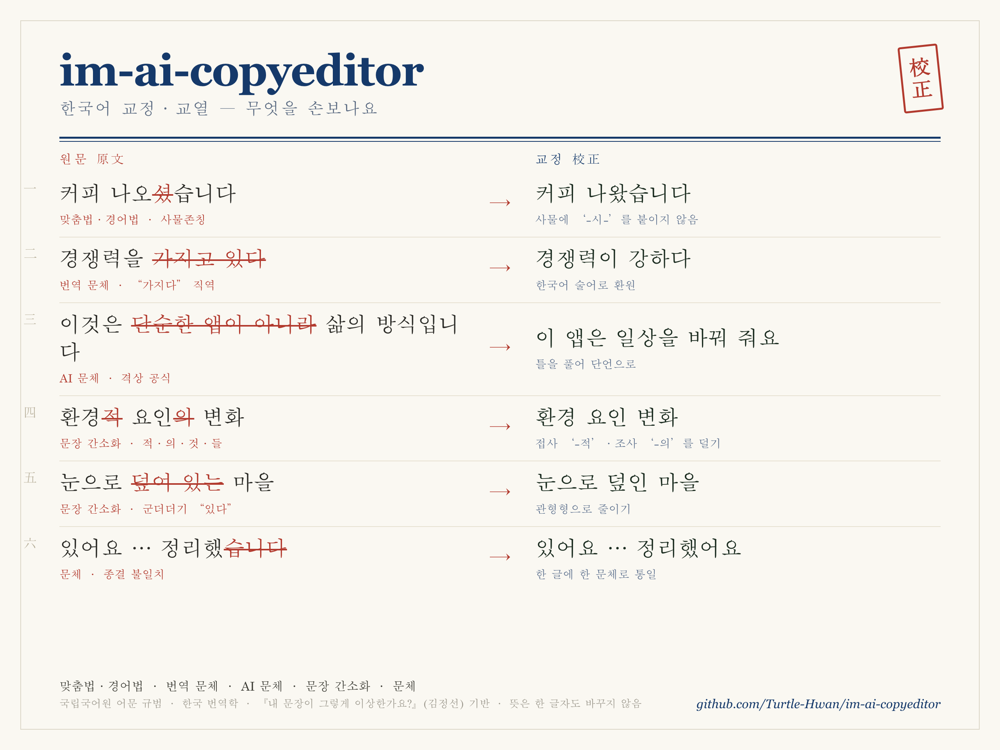

# im-ai-copyeditor

> **AI copyeditor for Korean.** 글이 AI든 사람이든, 진짜 교정·교열가처럼 한 문장 한 문장 꼼꼼히 첨삭해요.

한국어 글을 다듬어주는 도구예요. 영어 번역체와 AI 챗봇 같은 말투에서 군더더기와 어색함을 덜어내어 사람이 읽기 좋은 문장으로 바꾸어줘요.

## 무엇을 손보나요

다섯 가지를 손봐요. **맞춤법·경어법 · 번역 문체 · AI 문체 · 문장 간소화 · 문체.** 뜻은 한 글자도 바꾸지 않고, 문장 단위로 한 줄씩 다듬어요.



## 이런 점이 달라요

- **LLM이 글을 한 줄 한 줄 모두 읽어요.**

  grep 이나 정규식으로 대충 훑지 않아요. 문장 부호 단위로 잘라 작업표를 만들고, 모든 문장을 빠짐없이 읽고 다듬어요.

- **번역체와 AI체를 사람 문체로 바꿔요.**

  내용은 그대로 두고 말투만 사람이 쓴 것처럼 고쳐요.

- **문장 교정은 책에서 영감을 받았어요.**

  문장 교정 규칙은 책 [『내 문장이 그렇게 이상한가요?』](https://product.kyobobook.co.kr/detail/S000001863138)에서 영감을 받아 더했어요.

- **한국어 특화 스킬이에요.**

  규칙은 국립국어원 어문 규범과 번역학·문체 논문에 근거해요.

## 명령어

하나만 쓰고 싶으면 따로 부르고, 다 적용하려면 통합 명령을 써요.

| 명령어 | 하는 일 |
|---|---|
| `/im-ai-copyeditor:all` | **통합**. 맞춤법 → 번역 문체 → AI 문체 → 문장 간소화 → 문체를 한 문장씩 차례로 적용 |
| `/im-ai-copyeditor:grammar` | 맞춤법·문체 교정. 예요/되/안, 띄어쓰기, 종결문체 통일, 사물존칭 |
| `/im-ai-copyeditor:sentence` | 문장 간소화. 적·의·것·들, 군더더기 "있다", 군더더기 피동, 조사 다듬기 |
| `/im-ai-copyeditor:trans` | 번역 문체 빼기. 피동→능동, 가지다·통해·대해, 무생물 주어, 대명사 남용 |
| `/im-ai-copyeditor:ai` | AI 문체 빼기. 첫째·둘째 나열, 결말 공식, 과장 어휘, 괄호·쉼표, 클리셰 |
| `/im-ai-copyeditor:grill` | **함께 고치기(대화형)**. 전체 맥락·표현이 맞는지 한 번에 하나씩 되묻고, 합의되면 압축·재집필까지 |

위 다섯은 빠른 1:1 교정이라 뜻과 문장 수를 그대로 지켜요. `:grill`만 결이 달라요 — 문장 단위 교정이 놓치기 쉬운 **전체 맥락**까지 되물으며 함께 고치고, 동의하면 문장을 합치거나 줄여 줘요(대화로 확인하니 안전해요).

위 슬래시 명령은 **플러그인**으로 깔았을 때 떠요(아래 설치 참고). **스킬**로 깔았으면 `im-ai-copyeditor` 처럼 이름으로 부르거나, 그냥 **"이 글 문장 다듬어줘"** 라고 하면 알아서 골라 줘요.

## 설치

### 한 줄 설치 — 가장 간편 (스킬)

```bash
curl -fsSL https://raw.githubusercontent.com/Turtle-Hwan/im-ai-copyeditor/main/install.sh | bash
```

공개 저장소를 받아 깔려 있는 도구(**Claude Code · Codex · OpenClaw · Hermes · Gemini CLI**)를 스스로 찾아 **스킬**로 연결해요. 설치 뒤 그냥 **"이 글 문장 다듬어줘"** 라고 하거나 스킬을 이름으로 불러요. 특정 도구만 깔려면 끝에 `-s -- --claude-only` 처럼 붙여요.

### Claude Code 플러그인 — 슬래시 명령 `/im-ai-copyeditor:all`

```
/plugin marketplace add Turtle-Hwan/im-ai-copyeditor
/plugin install im-ai-copyeditor@im-ai-copyeditor
```

플러그인으로 깔면 `/im-ai-copyeditor:all`·`:grammar`·`:sentence`·`:trans`·`:ai` 슬래시 명령이 생겨요. (위 한 줄 설치는 **스킬**만 깔아 이름·자연어로 불러요 — 둘은 부르는 방식만 다르고, 같은 규칙을 써요.)

### 도구별 설치 위치

| 도구 | 어디에 깔리나 | 부르는 법 |
|---|---|---|
| **Claude Code** | `~/.claude/skills/` (스킬) · 마켓플레이스(플러그인) | `im-ai-copyeditor` 스킬 · `/im-ai-copyeditor:all` · "이 글 다듬어줘" |
| **Codex** | `~/.codex/skills/` · `~/.agents/skills/` | "이 글 문장 다듬어줘" |
| **OpenClaw** | `~/.openclaw/skills/` · `~/.agents/skills/` | "이 글 문장 다듬어줘" |
| **Hermes** | `~/.hermes/skills/writing/` | "이 글 문장 다듬어줘" |
| **Gemini CLI** | `gemini extensions link` (확장) | `/im-ai-copyeditor` |

### 직접 클론 — 수정·개발용

```bash
git clone https://github.com/Turtle-Hwan/im-ai-copyeditor
cd im-ai-copyeditor
./install.sh            # 깔린 도구를 자동 감지해 연결
```

심링크가 기본이라 `git pull` 로 갱신돼요. 옵션 — 특정 도구만 `--claude-only` 등 · 복사 `--copy` · 미리보기 `--dry-run`.

```bash
./update.sh    # 새 버전 확인·적용
./uninstall.sh # 제거
```

## 동작 방식

핵심은 **LLM이 모든 문장을 한 줄씩 읽고 다듬는다는 데** 있어요. 정규식으로 한꺼번에 바꾸지 않아요.
한 문장이라도 빠뜨리지 않으려고 작은 도구 두 개로 흐름을 묶었어요.

1. **자르기** — `scripts/segment.py` 가 글을 문장 부호 기준으로 잘라 작업표를 만들어요.
   제목·목록·코드 블록은 손대지 않아요.
2. **다듬기** — 에이전트가 작업표의 문장을 위에서 아래로 하나씩 읽고 고쳐요. 고칠 게 없으면 그대로 둬요.
3. **되붙이기** — `scripts/reassemble.py` 가 다듬은 문장을 원래 구조에 맞춰 다시 한 편으로 이어요.

되붙일 때 두 가지를 자동으로 지켜요. 들어간 문장 수와 나온 문장 수가 다르면 멈춰요. 너무 많이
바뀌어도 멈춰요. 둘 다 원문을 망치지 않으려는 장치예요.

원하면 `scripts/scan.py` 로 정규식 힌트를 켤 수 있어요. 맞춤법·표기 오타(예요/에요·됬·역활 같은
고정 오류)처럼 정규식이 확실히 잘 잡는 것만 규칙 번호로 살짝 달아 줘요. 번역 문체·AI 문체처럼
문맥을 봐야 하는 건 정규식 대신 규칙 글의 예시로 에이전트가 직접 판단해요. 다듬는 일은 어디까지나 에이전트가 해요.

## 규칙

규칙은 모두 `references/` 폴더에 글로 정리했어요. 국립국어원 어문 규범과 번역학·문체 논문에 근거해요.

- `grammar-rules.md` — 맞춤법. 국립국어원 어문 규범 기준.
- `translationese-rules.md` — 번역 문체. 한국 번역학 연구를 실용 규칙으로 옮겼어요.
- `ai-tell-rules.md` — AI 문체. AI 글과 사람 글을 비교한 논문에 근거해요.
- `sentence-rules.md` — 문장 간소화. 책 [『내 문장이 그렇게 이상한가요?』](https://product.kyobobook.co.kr/detail/S000001863138)(저자 김정선, 유유, 2016)에서
  영감을 받았어요.
- `style-guide.md` — 문체·경어법. 국립국어원 기준의 종결문체 일관성과 사물존칭·간접높임.
- `prime-directives.md` — 모든 명령이 함께 지키는 약속.

각 규칙은 "무엇을 찾고 어떻게 고치고 예를 들면 이렇게" 형식이에요. 예시만 읽어도 감이 와요.

## 기여

번역 문체와 AI 문체, 맞춤법 예시는 모을수록 좋아져요. 새 예시와 새 규칙은 누구나 보탤 수 있어요.
방법은 [CONTRIBUTING.md](CONTRIBUTING.md) 에 있어요.

## 개발

```bash
python3 -m unittest discover -s tests
```

따로 설치할 것 없이 파이썬 표준 기능만 써요.

## 라이선스

[MIT](LICENSE)

책 내용의 저작권은 원저작자에게 있어요.

이 저장소는 그 책에서 영감을 받아 도구로 옮겼어요. 책 내용을 그대로 옮겨 싣지는 않았어요.
